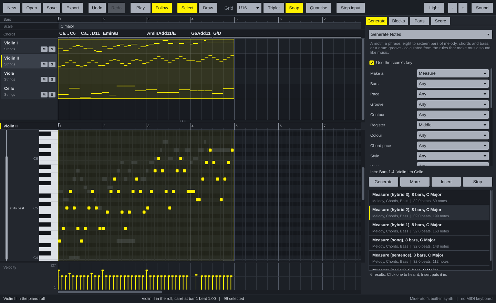
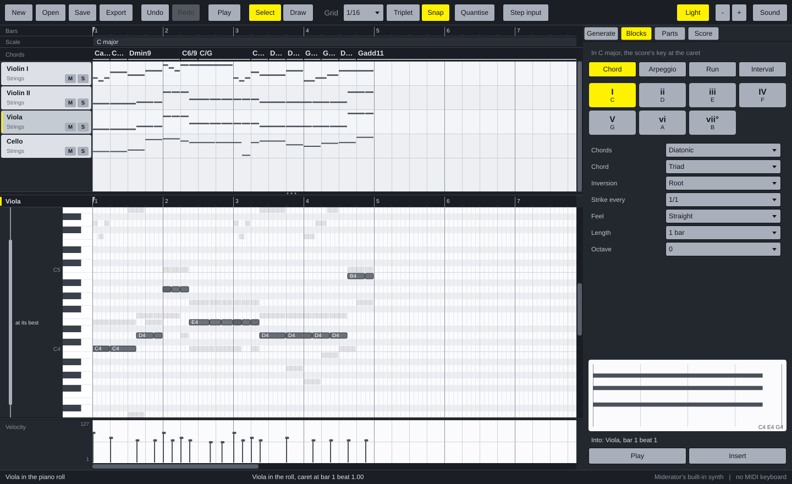

# Miderator

A Mac app that writes music with you, on a piano roll. Most of the music
comes from the family's generators - **Generate Notes** (Good Idea) first,
**Suggest Notes** (Midi Suggester) for ideas around what you have, **Vary
Notes** (Midi Variator) to change it, and **Starting Blocks** as a toolbox of
chords, arpeggios, runs and intervals - and lands as MIDI notes on a piano
roll you can edit, play and export, the way Cubase and Ableton show them.

Miderator is [Noterator](https://github.com/KallumS/Noterator) with the
notation taken out and a piano roll put in. Everything else - the
generators, the ensembles, the instruments, the sound, the files - is
Noterator's, and the two open each other's projects.



## What it does

- **Tracks and a piano roll.** Every instrument is a track along the top,
  its notes drawn small in its bars. Click a track and its notes open in the
  piano roll below: a keyboard down the side, each note a bar as long as it
  sounds, the other instruments shown faintly behind, and how hard each note
  is played in the Velocity lane underneath.
- **Generators built in.** Drag across some bars in the tracks, choose a
  generator, press Generate, click a result to hear it, press Insert: the
  music fills exactly those bars, the tune on top, the bass at the bottom,
  the chords shared out between. Every instrument gets only what it can play: a
  violin never gets chords, only their top line.
- **Starting Blocks as a toolbox.** Pick a chord, arpeggio, run or interval;
  every degree of the key is a button. Click one to see and hear it, Insert
  to put it at the caret - then the next one goes after it.
- **Edit it like a DAW.** Click a note to hear it, drag it to move it, drag
  its end to make it longer, Alt-drag to copy it, double-click to draw one -
  or switch to the Draw tool. Everything snaps to a grid you choose, from a
  bar down to a 1/32, with triplets. Quantise pulls notes onto the grid.
- **Play it in.** Turn on Step input and play a MIDI keyboard: each note
  goes in at the caret, one grid step long, and the caret moves on.
- **Start from an ensemble.** New offers small groups, whole orchestral
  sections, a chamber or full orchestra, and a big band - every instrument
  with a sound of its own.
- **It knows the instruments.** Beside the keys, a bracket shows each
  instrument's range, thick where it sounds best. Notes it cannot play turn
  red, notes outside where it sounds best turn grey, and a chord on a
  one-line instrument, a run faster than it can play or a leap too wide get
  a red corner - hover over a note to see why.
- **Chords and scales on the timeline.** Two lanes along the top name the
  chords and the scale as you write. Click a chord to hear it.
- **Hear it.** Plays through the General MIDI orchestra built into macOS - no
  sounds to install - with AutoCC's swells on strings, wind and brass.
- **Follow the music.** While it plays, the tracks and the roll scroll
  smoothly along with it, the playhead a third of the way across so you see
  what is coming. Or turn a page at a time, or keep the view still (the
  **Follow** button, or **F**).
- **Take it with you.** Export the whole song or the chosen bars as MIDI
  (with all four AutoCC lanes, for sample libraries), as MusicXML for
  Dorico, Sibelius, MuseScore or Finale, or as WAV audio. Open or drop in a
  MIDI or MusicXML file to bring one in.
- **Dark**, as a DAW is, or light if you prefer (the **Light** button).



## Installing on a Mac

The app is built automatically on GitHub every time the code changes.

1. Open the repository's **Actions** tab on GitHub, click the latest green
   **Build** run, and download **Miderator-macOS** under *Artifacts*. (Once a
   version is tagged, it is also under **Releases**.)
2. Unzip it and open `Miderator-macOS.dmg`. Drag Miderator into Applications.
3. The first time only, **right-click** Miderator in Applications and choose
   **Open**. macOS asks because the app is not yet signed with an Apple
   Developer certificate. If it says the app is "damaged", see
   [docs/INSTALL-MAC.txt](docs/INSTALL-MAC.txt) - it is one line in Terminal.

It needs a Mac with Apple silicon (M1 or later).

## Using it

| | |
| --- | --- |
| Start a song | **File** > **New**: a small group, a whole orchestral section, a chamber or full orchestra, or a big band |
| Bring music in | **File** > **Open**, or drop a MIDI, MusicXML or project file on the window |
| Show a part in the piano roll | click its name in the tracks (**Alt+Up/Down** for the next) |
| Choose bars | click a bar in a track; drag across bars and tracks for more; drag along the Chords lane for every part; **Esc** lets go |
| Generate | **Generate** tab: choose a generator, **Generate**, click a result to hear it, **Insert** - into the chosen bars, or the part in the roll |
| Blocks | **Blocks** tab: choose a kind, click a degree to see and hear it, **Insert** at the caret |
| Draw notes | double-click the roll, or **D** for the Draw tool: click to draw, drag to make it longer, click a note to delete it |
| Select | click a note; **Shift**-click for more; drag on empty space to lasso |
| Change notes | drag to move, drag an end to stretch, **Alt**-drag to copy; **Up/Down** a semitone, **Shift+Up/Down** an octave; **Delete** |
| The grid | **1-6** a bar down to 1/32, **T** triplets, **Snap** on or off, **Q** quantise |
| Velocity | drag across the Velocity lane under the roll |
| Play it in | **R** for Step input, then play a MIDI keyboard |
| Hear | **Space** plays from bar 1; **Shift+Space** (or **Play**) plays from the caret - click the bar numbers or a note to move it |
| Start and end | **\|◀** beside Play (or **Home**) goes back to bar 1; **▶\|** (or **End**) to the end of the music |
| Follow the music | **Follow** (or **F**) scrolls along with the music as it plays, the playhead a third of the way across; switch it off to keep the view still. To turn a page at a time instead: **Play** menu, **Turn a Page at a Time** |
| Take it out | **File** > **Export**: the song or the chosen bars as MIDI, MusicXML or WAV |
| Undo | **Cmd+Z**, **Shift+Cmd+Z** |
| All the keys | **H** |

The **Parts** tab adds and removes instruments, and shows what each one can
do. The **Score** tab sets the title, tempo, time signature and key.

## Where it is going

Next, roughly in order:

- CC lanes you can draw on, under the roll beside the velocity lane, seeded
  by AutoCC;
- articulations, and articulation switching for sample libraries;
- VST3 and CLAP instruments per part, and SoundFonts through the Mac's synth;
- real-time recording from a MIDI keyboard;
- Windows.

## For developers

```sh
# the core and its tests: no JUCE, seconds
cmake -B build-core -G Ninja -DMIDERATOR_BUILD_APP=OFF && cmake --build build-core
ctest --test-dir build-core --output-on-failure

# the generators, outside the app
lua5.4 tools/try_generators.lua

# everything: the app and the PNG renderer (downloads JUCE)
cmake -B build -G Ninja -DCMAKE_BUILD_TYPE=Release && cmake --build build
./build/MideratorRender_artefacts/Release/MideratorRender demo roll.png
```

[CLAUDE.md](CLAUDE.md) is the working guide, [docs/ARCHITECTURE.md](docs/ARCHITECTURE.md)
the shape of it and every big decision, [docs/decisions](docs/decisions/README.md)
the reasons in full, [docs/SHARED.md](docs/SHARED.md) what is shared with
Noterator, and [docs/NEXT-SESSION.md](docs/NEXT-SESSION.md) the prompt to
carry on in a new session.

## Credits

- The generators are KallumS's Good Idea, Midi Catalogue, Midi Suggester, Midi
  Variator and Starting Blocks; chord naming is ScaleView's; AutoCC's curves
  are AutoCC's; everything underneath the piano roll is Noterator's.
- [Lua](https://www.lua.org) 5.4, MIT. [JUCE](https://juce.com) 8.
